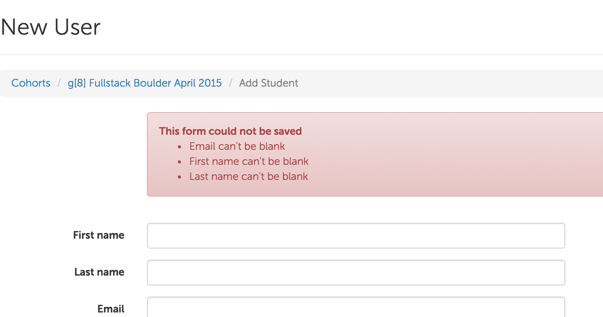
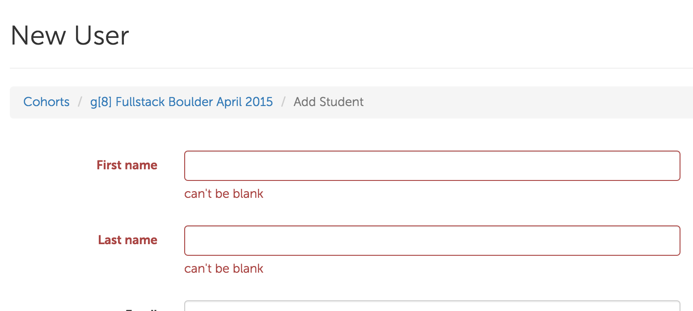
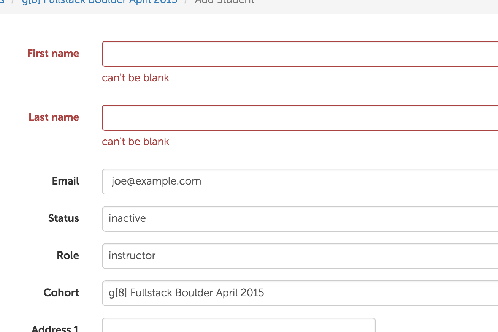

# Intro to Form Validations in Express

## Set Up

- Read through this document to get familiar with the concepts
- Generate a new express app
  - remember the `--git` flag
  - choose a template engine that you are comfortable with
- Complete all of the stories below

## Validation overview

When users submit forms, sometimes they don't enter data in the format that your application requires.  Some examples of these are:

- users leave fields blank (or submitting forms where values are just whitespace)
- users enter data in the wrong format (such as leaving out the @ in an email)
- users enter data that is out of valid ranges (such as entering an age of 230 for a person)
- users entering duplicate data (like trying to sign up to your site with an email address that's already in use)

These rules ("first name is required", "emails must be unique") are called **validation rules**.  Collectively, the concept of checking user input before processing form data is called **validations**.

## UI

From a UI perspective, when a user submits a form that has data that does satisfy your application's constraints, three things should happen:

- The user should see the form again
- The user should see error messages
- The form fields should be pre-populated

This is one way to show validations:



Or maybe they'll show up like this:



Styles will vary depending on your site's design.  But regardless, the errors need to be clear and concise and helpful to the user.

Another important point is that form fields need to remain filled-in, even when forms are re-rendered to show errors.  In the following example, note how the user has filled in an email, so even though the form was re-rendered, the email field is remains filled-in:



## Render vs Redirect

When a user submits a form, and the form data is invalid, then the server re-renders the form.

This may seem backwards, because:

- If the form post is _unsuccessful_ you _render_ a 200 OK
- If the form post is _successful_ you redirect

Why?  Think about the UI for a moment - you always want to re-populate fields, and you also need to pass down information about which fields are blank, and what their error messages are.

In order to pass information from Express's routes into a view, you need to have the data available - in this case, it's most likely `req.body`.  Once you redirect, you lose that information.

You _could_ store information like that in a cookie, or in a session object, but that adds extra unnecessary complexity.  So the rule is:

- Re-render (200 OK) when the data is invalid
- Redirect when it's valid

## Implementing

The good news is that adding validations to forms doesn't require any new special knowledge - just putting together things you already know.  Here's the basic flow:

- In your routes (or in a separate module), check the data passed into `req.body` using simple `if` statements
- If the data is valid, `res.redirect`
- If the data is not valid, `res.render`

So in it's most basic form, it might look something like this:

```js
router.post('/users', function (req, res) {
  if (req.body.firstName.trim()) {
    User.insert({first: req.body.firstName}).then(function () {
      res.redirect('/users')
    })
  } else {
    res.render('users/new', {errors: ["First name can't be blank"]})
  }
})
```

A slightly more complicated example might look like this:

```js
router.post('/users', function (req, res) {
  var errors = []
  if (!req.body.firstName.trim()) {
    errors.push("First name can't be blank")
  }
  if (!req.body.lastName.trim()) {
    errors.push("Last name can't be blank")
  }
  if (errors.length) {
    res.render('users/new', {errors: errors})
  } else {
    User.insert({first: req.body.firstName}).then(function () {
      res.redirect()
    })
  }
})
```

Of course, this type of logic is more well-suited in a separate module, or as part of a model object, but the above examples demonstrate the basic point.

## Uniqueness validations

When you need to check that a field is unique, there are a few ways to do it.

### Technique #1: Check First

One way is to make a query to the database to see if that field exists.  If the DB returns a record, it means that the form is _invalid_, which looks like this:

[](http://www.websequencediagrams.com/?lz=dGl0bGUgVmFsaWRhdGlvbnMKCkJyb3dzZXItPkV4cHJlc3M6IFBPU1QgL3VzZXJzCgAOBy0-REI6IGRiLgARBS5maW5kKHtlbWFpbDogImFAZXhhbXBsZS5jb20ifSkKREIAQwt7X2lkOiAiNXJlLi4uIiwgAB8XAGAKAIEKBzogMjAwIE9LIChyZS1yZW5kZXIgZm9ybSkK&s=mscgen
)

If you check the database to see if it already has a value, and the database returns `null`, then the form data is valid, and it's OK to insert.

[](http://www.websequencediagrams.com/?lz=dGl0bGUgVmFsaWRhdGlvbnMKCkJyb3dzZXItPkV4cHJlc3M6IFBPU1QgL3VzZXJzCgAOBy0-REI6IGRiLgARBS5maW5kKHtlbWFpbDogImFAZXhhbXBsZS5jb20ifSkKREIAQwtudWxsADAXaW5zZXJ0KHsuLi4AJhB7X2lkOiAiNGVkLi4uIn0AfgoAgSgHOiByZWRpcmVjdCB0bwCBJQgAgTkSR0UAgTgSADkJMjAwIE9LCg&s=mscgen)

### Technique #2: Insert and handle errors

This can create a [race condition](https://en.wikipedia.org/wiki/Race_condition).  So another approach is to add database constraints to ensure that duplicate data cannot be inserted.

[](http://www.websequencediagrams.com/?lz=dGl0bGUgVmFsaWRhdGlvbnMKCkJyb3dzZXItPkV4cHJlc3M6IFBPU1QgL3VzZXJzCgAOBy0-REI6IGRiLgARBS5pbnNlcnQoey4uLn0pCkRCADILRVJST1I6IGR1cGxpY2F0ZSBkYXRhAD0KAGcHOiAyMDAgT0sK&s=mscgen)

This is only viable if your database provides unique indexes.  Many databases support this:

- http://docs.mongodb.org/manual/tutorial/create-a-unique-index/
- http://www.postgresql.org/docs/9.4/static/indexes-unique.html

## Includes

You should make your site's UI as consistent as possible when displaying errors to users.  One way to enforce this consistency is to create an "include" (aka "partial").  So instead of duplicating error code in multiple places, you have one file that contains your markup / code for displaying errors, and you include that in multiple places.

## Stories

### Users can create people

```
When a user goes to the site's homepage
And clicks "Add a Person"
And fills out the form
And clicks "Create Person"
Then they should see the created person on the people index page
And a success message should appear
```


### Errors are displayed when a form is not filled out correctly

```
When a user fills out a form
And clicks "Submit"
When any of the form fields are blank (or invalid)
Then the 'new' template should be re-rendered and error messages should appear
```


### Person names must be unique

```
When a user fills in the name field with a name that already exists in the database
And clicks "Submit"
Then the 'new' template should be re-rendered and error messages should appear that read "Name is already taken"
```

BONUS:  implement this story using unique constraints and error-handling.  How would you add the unique index to the table?   Directly in the console?  If so, how would you get that change onto other developer's machines, and into production?


### Extract an error partial

Now that you have error messages, create an errors partial, and include it in your form.

- http://jade-lang.com/reference/includes/
- https://github.com/barc/express-hbs
- https://scotch.io/tutorials/use-ejs-to-template-your-node-application
